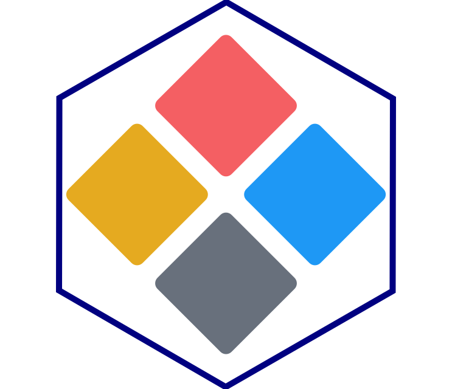

<!-- badges: start -->
  [](https://github.com/novica/shinyds/actions/workflows/R-CMD-check.yml)
  [](https://app.codecov.io/gh/novica/shinyds)
  [](https://CRAN.R-project.org/package=shinyds)
  [](https://CRAN.R-project.org/package=shinyds)
  [](https://github.com/digdir/designsystemet/releases)  
<!-- badges: end -->

# shinyds - Designsystemet components for Shiny 



`shinyds` brings [Designsystemet](https://designsystemet.no) — the Norwegian government's shared design system — to Shiny. It provides `ds_*` R functions that produce accessible, consistently styled UI components following Norwegian public sector design guidelines.

## Why shinyds?

Norwegian public sector applications are expected to follow Designsystemet's guidelines for visual consistency and accessibility. `shinyds` means you don't have to write CSS classes or HTML by hand: call `ds_button()`, `ds_alert()`, `ds_tabs()`, and the right markup, styles, and behaviour come with it. Components that carry Shiny reactivity return values through `input$id` just like native Shiny inputs.

## Installation

### From CRAN

```r
install.packages("shinyds")
```

### From GitHub

```r
# install.packages("remotes")
remotes::install_github("novica/shinyds")
```

## Quick start

```r
library(shiny)
library(bslib)
library(shinyds)

ui <- bslib::page_fluid(
  use_designsystemet(),
  ds_heading("Hello Designsystemet!", level = 1),
  ds_field(
    ds_label("Your name", `for` = "name"),
    ds_input("name", placeholder = "Enter your name")
  ),
  ds_button("Greet", inputId = "btn", variant = "primary"),
  uiOutput("greeting")
)

server <- function(input, output, session) {
  output$greeting <- renderUI({
    req(input$btn, input$name)
    ds_alert(paste("Hello,", input$name), variant = "success")
  })
}

shinyApp(ui, server)
```

`use_designsystemet()` must appear in the app's UI — it loads the CSS and JavaScript and activates the design token color scheme.

## Demo

[Old Faithful](https://novica-faitful.share.connect.posit.cloud)

## Example apps

Three example apps are bundled with the package:

| App | Description | Run |
|---|---|---|
| `basic` | Minimal contact form — button, text inputs, checkbox, reactive output | `shiny::runApp(system.file("examples/basic", package = "shinyds"))` |
| `faithful` | Old Faithful data explorer — tabs, sidebar, plot, table | `shiny::runApp(system.file("examples/faithful", package = "shinyds"))` |
| `showcase` | Full component reference with live reactive values | `shiny::runApp(system.file("examples/showcase", package = "shinyds"))` |

## What's included

`shinyds` covers the full Designsystemet component set: form controls (button, input, checkbox, radio, select, textarea, search, suggestion), layout (card, table, tabs, pagination), typography (heading, paragraph, link, list), and feedback (alert, badge, spinner, skeleton). Components compose naturally with `bslib` layout functions.

## Learn more

- **Getting Started** — form controls, layout, typography, and updating inputs from the server:
  `vignette("getting-started", package = "shinyds")`
- **Reactivity Patterns** — wiring up Shiny reactivity for toggle group, details, dialog, popover, and fieldset:
  `vignette("reactivity-patterns", package = "shinyds")`
- [Designsystemet documentation](https://designsystemet.no)
